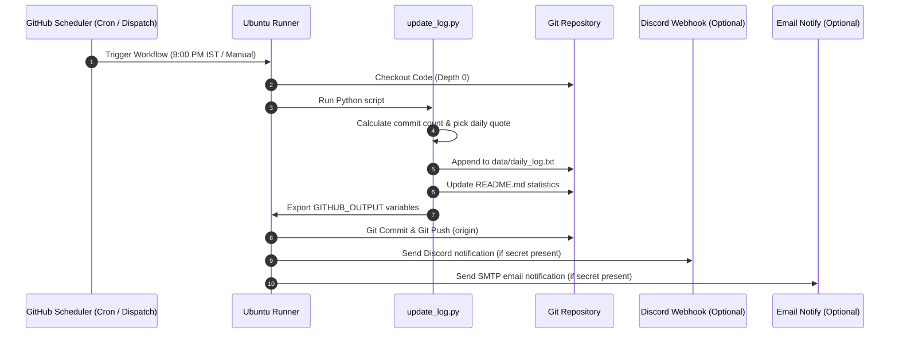

# 🚀 GitHub Actions Daily Auto Commit Project

[](https://github.com)
[](https://python.org)
[](https://github.com)

A robust, production-ready automation system designed to maintain an active GitHub contribution graph by automatically logging daily updates, selecting motivational quotes, and pushing commits to your repository entirely on GitHub servers—**even when your laptop is completely powered OFF.**

---

## 📊 Repository Statistics

These statistics are dynamically updated by the automated pipeline on each successful run:

<!-- STATS_START -->
| Metric | Value |
| :--- | :--- |
| **Total Automated Commits** | `2` |
| **Last Successful Run** | `2026-06-12 21:54:01 IST` |
| **System Status** | `🟢 Operational` |
<!-- STATS_END -->

---

## 🛠️ System Architecture

The following sequence diagram illustrates how the automated daily pipeline triggers, logs data, updates statistics, commits code, and sends notifications:



---

## ✨ Features

- **Automatic Daily Commits**: Configured to run every single day at **9:00 PM IST** (`15:30 UTC`).
- **Serverless Execution**: Works entirely on GitHub's cloud-hosted Ubuntu runners. No local setup, cron jobs, or active internet connection on your personal machine required.
- **Timestamp Logging**: Appends structured dates, local times in IST, commit indices, and motivational quotes to `data/daily_log.txt`.
- **Dynamic Commit Messages**: Randomly chooses from a pool of professional messages or builds structured auto-increment commits (e.g. `Auto Commit #42`).
- **Live Repository Statistics**: Auto-updates the markdown stats table directly in this README file.
- **Optional Webhook & SMTP Notifications**: Built-in support to send real-time alerts to Discord webhooks and custom emails when the workflow succeeds.
- **Contribution Graph Maintenance**: Consistent activity logs keep your contribution graph green.
- **Manual Workflow Execution**: Supports `workflow_dispatch` so you can manually trigger a commit directly from the GitHub UI at any time.

---

## 📂 Repository Structure

```directory
auto-commit-repo/
│
├── .github/
│   └── workflows/
│       └── daily_commit.yml    # GitHub Actions workflow configuration
│
├── data/
│   └── daily_log.txt          # Appended list of timestamps and quotes
│
├── scripts/
│   └── update_log.py          # Python execution script
│
├── .gitignore                 # Files and directories to ignore
└── README.md                  # System documentation & statistics
```

---

## 🚀 Setup Guide

To deploy this automation system to your own GitHub account:

### 1. Create a New Repository
1. Go to [GitHub](https://github.com) and create a **private** or **public** repository.
2. Initialize it with a name (e.g., `auto-commit-repo`).

### 2. Upload Project Files
Clone your repository locally, copy all the files from this directory, and push them to your repository:
```bash
git add .
git commit -m "Initial repository setup"
git push origin main
```

### 3. Configure Workflow Permissions (CRITICAL 🔑)
By default, the `GITHUB_TOKEN` provided to actions has read-only access. You must grant write permissions so the runner can push commits back:
1. In your GitHub repository, navigate to **Settings** > **Actions** > **General**.
2. Scroll down to **Workflow permissions**.
3. Select **Read and write permissions**.
4. Click **Save**.

### 4. Configure Webhooks & Notifications (Optional)
If you want to receive alerts, navigate to **Settings** > **Secrets and variables** > **Actions** and add:
- **Discord Alerts**: Add a Repository Secret named `DISCORD_WEBHOOK` with your channel's webhook URL.
- **Email Alerts**: Add secrets:
  - `SMTP_SERVER` (e.g., `smtp.sendgrid.net` or `smtp.gmail.com`)
  - `SMTP_PORT` (e.g., `465` or `587`)
  - `SMTP_USERNAME` (your username)
  - `SMTP_PASSWORD` (your SMTP API key or password)
  - `NOTIFY_EMAIL` (destination email address)

### 5. Manually Test the Workflow
1. Go to the **Actions** tab of your repository.
2. Select **Daily Auto Commit** from the left sidebar.
3. Click **Run workflow** and select the branch (usually `main`).
4. Click the green **Run workflow** button.
5. Review the run log, watch it execute, and verify that `data/daily_log.txt` and `README.md` have been updated and pushed!

---

## ⚙️ Error Handling & Guardrails

- **Empty Commit Prevention**: The workflow uses `git diff --quiet` to check if modifications exist before trying to create a commit. This prevents unnecessary errors and empty commits when no changes occurred.
- **Push Failure Handling**: The push step targets `HEAD:${{ github.ref }}` directly. If a concurrent push occurs, GitHub Actions will safely stop or can be easily retried.
- **Missing File Handling**: The Python script dynamically creates the `data` directory and `daily_log.txt` if they are missing, preventing crash conditions.
- **Robust Time Math**: Timetime timezone offset calculation uses native Python standard library tools, removing external package dependencies (like `pytz`) that could fail to install on clean runners.

---

## 🔒 Security Overview

### The Role of `GITHUB_TOKEN`
GitHub automatically creates a unique `GITHUB_TOKEN` secret for every workflow run. This token represents the permissions of the workflow runner. In this project, we explicitly request:
```yaml
permissions:
  contents: write
```
This permission allows the token to push files to the repository code history (`contents`).

### Why Personal Access Tokens (PATs) are Unnecessary
A Personal Access Token (PAT) is tied to a user account and has broad access across multiple repositories. Using a PAT in a GitHub Actions workflow introduces security risks if the token is leaked. 

By using the built-in `GITHUB_TOKEN` with explicit write permissions, we ensure:
1. **Scope Isolation**: The token is only authorized to write to *this specific repository*.
2. **Ephemeral Lifespan**: The token expires automatically as soon as the workflow run completes, preventing reuse.

---

## 💡 Troubleshooting

- **Workflow runs but fails to push changes**:
  - *Cause*: Read/Write permissions are not enabled in repository settings.
  - *Solution*: Follow step 3 of the [Setup Guide](#3-configure-workflow-permissions-critical-) to change workflow permissions to "Read and write".
- **Chron schedule delays**:
  - *Note*: GitHub Actions scheduling can occasionally be delayed by 5-15 minutes depending on GitHub's active queue load. This is normal behavior and commits will still land successfully.
- **Missing quotes or metrics in log**:
  - *Note*: If you run the Python script locally outside of GitHub Actions, it will warn you that it cannot find `GITHUB_OUTPUT` environment variables. This is expected and does not impact local functionality.
# AUTOCOMMIT
